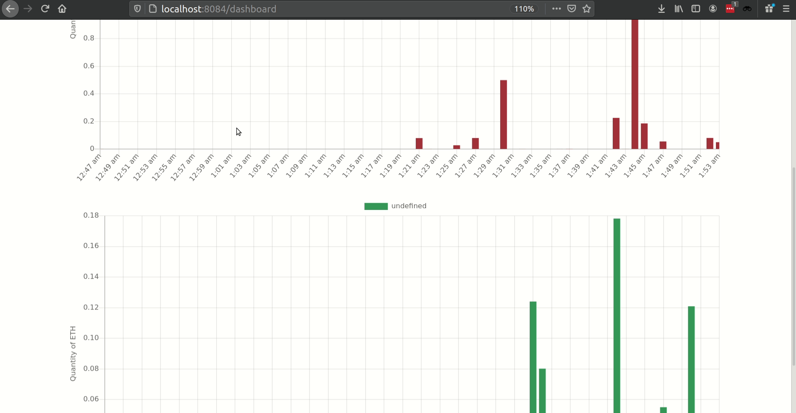
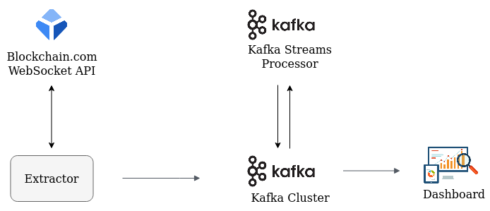

# BTC/USD Analytics

A data pipeline that collects data for trades of BTC/USD executed on 
[exchange.blockchain.com](https://exchange.blockchain.com) and feeds a dashboard showing the quantity of
BTC/USD traded every minute. The charts are updated in near real-time.

## Pipeline Architecture Overview

The first component of the pipeline is `Extractor`, A command line Java program written with JDK 11. It opens a 
persistent WebSocket connection to the [Blockchain WebSocket API](https://exchange.blockchain.com/api/#websocket-api). 
As new trades are executed on the exchange, `Extractor` receives their data and writes them to the Kafka `input topic`.  

Next component of the pipeline is a stream processing program built with the Kafka Streams library. It continuously 
polls the Kafka `input topic`, aggregates the data and writes to the `output topic`.

The final component of the pipeline is a Spring Boot application that serves the frontend assets for the web UI, and 
a provides a REST endpoint for fetching data that is displayed on charts. The UI consists of bar charts drawn using 
the ChartJS library. The frontend calls the data endpoint every 10 seconds and this causes the application to poll 
the Kafka `output topic`.

There is no database. A crude Key-Value store is implemented in memory using `HashMap`s. The contents of this datastore
are sent in response to API calls from the frontend, and it is updated if polling Kafka returns any items.

## Tech Stack

* Java 11
* Apache Kafka
* Spring Boot
* Bulma CSS
